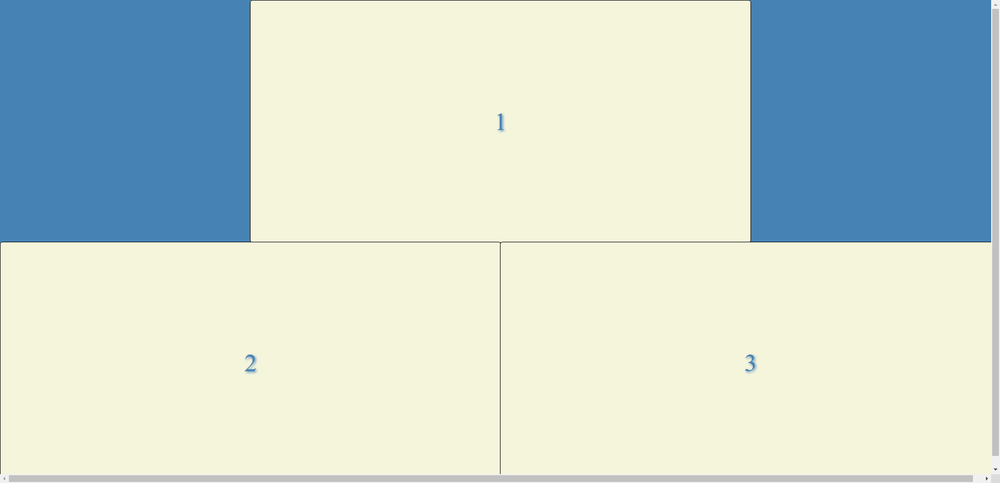

# Zoom-grid render function
Configurable function that renders zoom grid. Any number of pariticpant rectangles are rendered properly according to the size of a viewport

Pull this repo to ypur local machine and start **index.html**. Enter a prompted **number of tiles** and check the function at work.

## Views:

2 tiles: 

3 tiles: 

4 tiles: 

8 tiles: 

15 tiles: 

